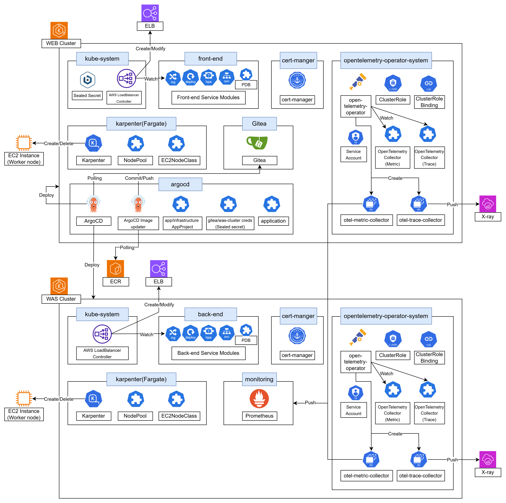
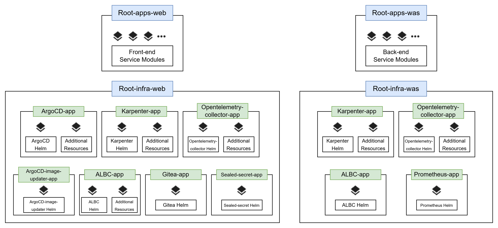

# GitOps for ArgoCD 
- Multi Cluster 환경 ArgoCD App of Apps 구조 프로젝트

## 아키텍처

## App of Apps 구조

## 폴더 구조

<table border="1" cellpadding="6" cellspacing="0" style="border-collapse: collapse; font-family: Arial, sans-serif;">
  <thead>
    <tr style="background-color:#f0f0f0;">
      <th>깊이</th>
      <th>폴더</th>
      <th>설명</th>
    </tr>
  </thead>
  <tbody>
    <tr>
      <td>0</td>
      <td>├argocd</td>
      <td>ArgoCD application 리소스 집합</td>
    </tr>
    <tr>
      <td>1</td>
      <td>├──bootstrap</td>
      <td>Root Application (전체 서비스 모듈 및 인프라)</td>
    </tr>
    <tr>
      <td>1</td>
      <td>├──infrastructure</td>
      <td>인프라 Application 리소스 집합</td>
    </tr>
    <tr>
      <td>2</td>
      <td>├────인프라 구성요소 (예: albc)</td>
      <td>인프라 구성요소 Application 리소스</td>
    </tr>
    <tr>
      <td>3</td>
      <td>├──────web/was-cluster</td>
      <td>클러스터별 설정</td>
    </tr>
    <tr>
      <td>0</td>
      <td>├apps</td>
      <td>서비스 모듈 리소스 집합</td>
    </tr>
    <tr>
      <td>1</td>
      <td>├──서비스 모듈명</td>
      <td>특정 서비스 모듈 리소스 집합</td>
    </tr>
    <tr>
      <td>2</td>
      <td>├────application</td>
      <td>서비스 모듈 application 리소스</td>
    </tr>
    <tr>
      <td>3</td>
      <td>├──────base</td>
      <td>공통 리소스</td>
    </tr>
    <tr>
      <td>3</td>
      <td>├──────overlays</td>
      <td>클러스터별 오버레이</td>
    </tr>
    <tr>
      <td>4</td>
      <td>├────────web/was-cluster</td>
      <td>클러스터별 설정</td>
    </tr>
    <tr>
      <td>2</td>
      <td>├────resources</td>
      <td>서비스 모듈 리소스 집합</td>
    </tr>
    <tr>
      <td>3</td>
      <td>├──────base</td>
      <td>공통 리소스</td>
    </tr>
    <tr>
      <td>3</td>
      <td>├──────overlays</td>
      <td>클러스터별 오버레이</td>
    </tr>
    <tr>
      <td>4</td>
      <td>├────────web/was-cluster</td>
      <td>클러스터별 설정</td>
    </tr>
    <tr>
      <td>0</td>
      <td>├infrastructure</td>
      <td>인프라 구성요소 리소스 집합</td>
    </tr>
    <tr>
      <td>1</td>
      <td>├──인프라 구성요소 (예: albc)</td>
      <td>인프라 리소스 집합</td>
    </tr>
    <tr>
      <td>2</td>
      <td>├────application</td>
      <td>추가 리소스용 Application 리소스</td>
    </tr>
    <tr>
      <td>3</td>
      <td>├──────base</td>
      <td>공통 리소스</td>
    </tr>
    <tr>
      <td>3</td>
      <td>├──────overlays</td>
      <td>클러스터별 오버레이
    </tr>
    <tr>
      <td>4</td>
      <td>├────────web/was-cluster</td>
      <td>클러스터별 설정</td>
    </tr>
    <tr>
      <td>2</td>
      <td>├────helm</td>
      <td>Helm 차트 Application 리소스</td>
    </tr>
    <tr>
      <td>3</td>
      <td>├──────base</td>
      <td>공통 리소스</td>
    </tr>
    <tr>
      <td>3</td>
      <td>├──────overlays</td>
      <td>클러스터별 오버레이
    </tr>
    <tr>
      <td>4</td>
      <td>├────────web/was-cluster</td>
      <td>클러스터별 설정</td>
    </tr>
    <tr>
      <td>2</td>
      <td>├────resources</td>
      <td>추가 리소스 집합</td>
    </tr>
    <tr>
      <td>3</td>
      <td>├──────base</td>
      <td>공통 리소스</td>
    </tr>
    <tr>
      <td>3</td>
      <td>├──────overlays</td>
      <td>클러스터별 오버레이
    </tr>
    <tr>
      <td>4</td>
      <td>├────────web/was-cluster</td>
      <td>클러스터별 설정</td>
    </tr>
  </tbody>
</table>